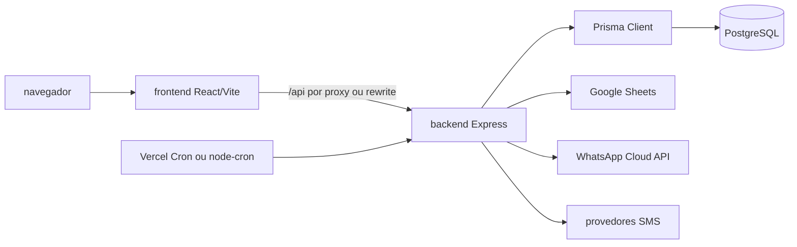

# Arquitetura do sistema

> Dois pacotes independentes formam uma SPA React e uma API Express multi-tenant.

## Diagrama de containers

## Entradas

`src/app.ts` configura o app sem efeitos de processo. `src/index.ts` inicia o servidor local e scheduler. `api/index.ts` reexporta o app para Vercel. Essa separação evita iniciar cron em cada invocação serverless.

## Fronteiras

- UI: navegação, formulários, visualizações e estado de sessão.
- API: autenticação, autorização, validação, efeitos e contratos HTTP.
- Serviços: regras de negócio e integrações.
- Prisma/PostgreSQL: persistência, histórico e fila inicial.

## Decisão de hospedagem

Produção usa dois projetos Vercel e Supabase PostgreSQL. O frontend mantém chamadas relativas `/api`; a reescrita aponta para o backend. Variáveis operacionais devem permanecer somente no provedor e em arquivos locais ignorados.

## Relações

- [[wiki/topics/modelo-de-dominio.md]]
- [[wiki/topics/operacao-e-deploy.md]]
- [[wiki/topics/seguranca-e-lgpd.md]]
