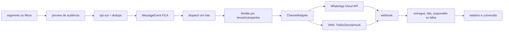

# Campanhas e mensageria

> A audiência é filtrada e enfileirada no Postgres antes de ser entregue por adaptadores de canal.

## Fluxo de envio

## Capacidades

- Público por segmento salvo ou filtros ad hoc.
- Templates aprovados e preview com placeholders.
- Agendamento e dispatch manual.
- Janela de dedupe e limite global de mensagens por tenant.
- Failover entre provedores SMS por prioridade.
- `test-send` para amostra sem tocar no público real.
- Variante A/B e teste z de duas proporções, com alerta para amostras pequenas.
- Relatório de status, custo, conversão, valor atribuído e exportação CSV.

## Segurança operacional

Webhook deve ser idempotente e autenticado. Credenciais são armazenadas cifradas. Opt-out precisa ser aplicado tanto no preview quanto no enfileiramento, evitando que uma alteração entre as duas etapas gere envio indevido.

## Relações

- [[wiki/topics/modelo-de-dominio.md]]
- [[wiki/topics/segmentacao-e-automacoes.md]]
- [[wiki/topics/seguranca-e-lgpd.md]]
