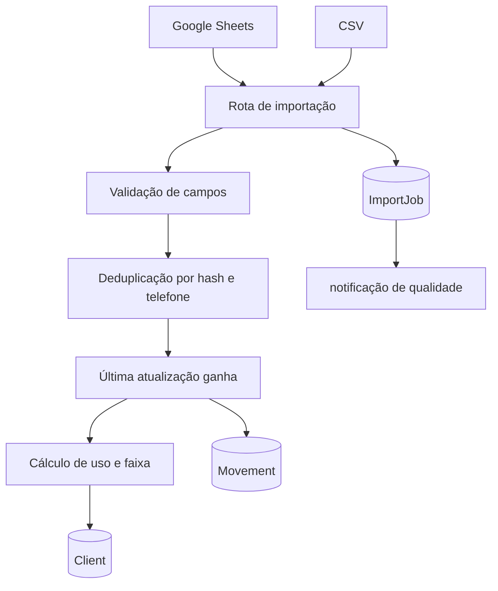

# Pipeline de importação

> Entradas tabulares passam por validação, deduplicação, cálculo de uso e persistência histórica.

## Fluxo

## Regras

`importService.ts` valida os campos mínimos, normaliza telefones, registra erros por linha e mantém contadores de adicionados, atualizados e rejeitados. `dedupe.ts` prioriza CPF/CNPJ já transformado em hash por tenant e usa telefone como fallback. Uma alteração de limite pode criar `Movement`, usado pelo motor de automação.

Limite ausente ou menor/igual a zero não gera divisão inválida nem falsa classificação de “não utilizou”; o resultado é uma situação `INDEFINIDO` conforme a regra de negócio documentada.

## Formatos

- Google Sheets via Service Account e mapeamento configurável.
- CSV com linhas parseadas.
- Formato específico de cartões e contas, alimentado pela aba `SaldoCartao`.
- Extrato de transações: entra pela `Purchase` (`/api/purchases/import`). `transactionClassifier.ts` decide pelo tipo o que conta como uso: antecipação via Pix (`Juros` é lucro) e compra à vista contam; assinatura, débito de fatura e tipos desconhecidos não.
- Histórico de conta (`AccountSnapshot`): a importação de cartões e contas registra mudanças de saldo, limite e status (e a primeira aparição do cliente), permitindo saber o saldo numa data passada e quando o limite voltou após o desconto em folha.

## Relações

- [[wiki/topics/modelo-de-dominio.md]]
- [[wiki/topics/segmentacao-e-automacoes.md]]
- [[wiki/topics/seguranca-e-lgpd.md]]
