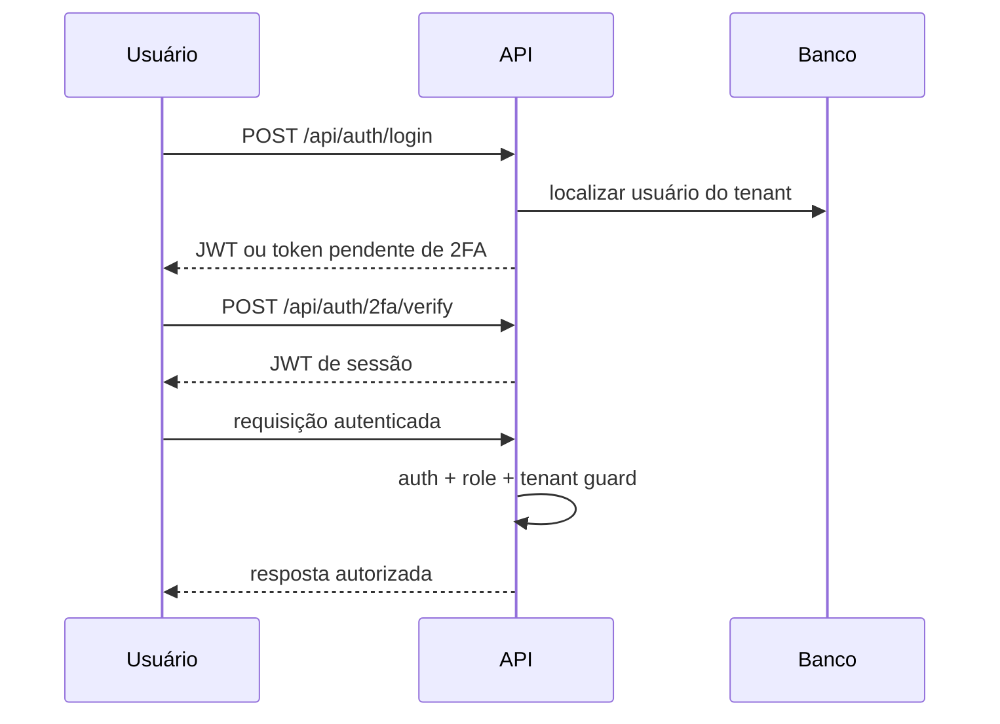

# Segurança e LGPD

> A proteção combina autenticação, autorização, isolamento de tenant, minimização de PII, criptografia e auditoria.

## Controles

| Área | Implementação | Observação |
|---|---|---|
| Autenticação | JWT e bcrypt | Token pendente de 2FA não vale como sessão normal. |
| Segundo fator | TOTP e QR code | Ativação e desativação são ações sensíveis. |
| Autorização | Roles e `requireRole` | Backend é a autoridade final. |
| Tenant | Contexto assíncrono e guard | Toda query deve respeitar a fronteira. |
| CPF/CNPJ | HMAC com salt por tenant + máscara | Não é reversível. |
| Credenciais | AES-256-GCM | Chave de aplicação não equivale a KMS/HSM externo. |
| Webhooks | Assinaturas de provedor | Falha de verificação deve impedir alteração de estado. |
| Auditoria | `AuditLog` e hash-chain | Permite verificar adulteração. |
| Retenção | Anonimização diária | Aplicada a clientes sem atividade além da política. |

## Fluxo de autenticação

## Limites e pendências

O repositório não deve ser tratado como prova de configuração externa. Estado de RLS, backups, rotação de chaves, rate limit distribuído e KMS/HSM real precisam ser verificados separadamente. Documentação pública nunca deve expor valores de ambiente.

## Relações

- [[wiki/topics/arquitetura-do-sistema.md]]
- [[wiki/topics/modelo-de-dominio.md]]
- [[wiki/topics/operacao-e-deploy.md]]
